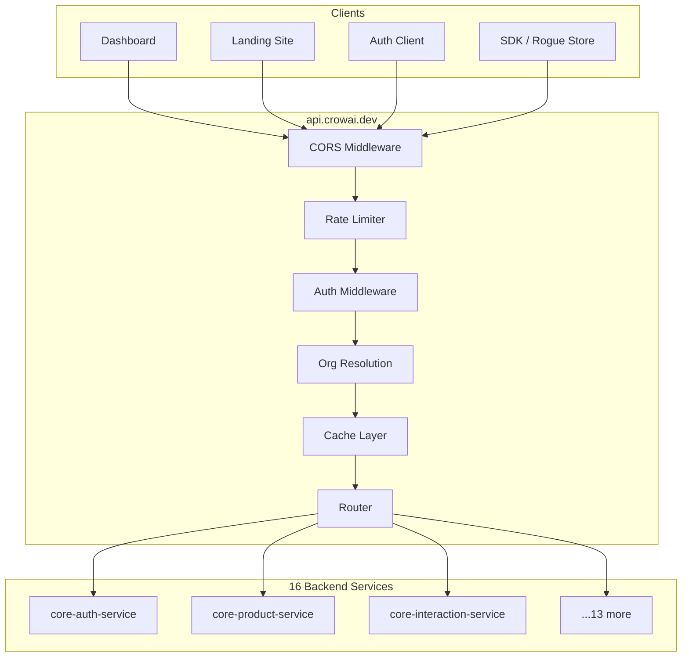
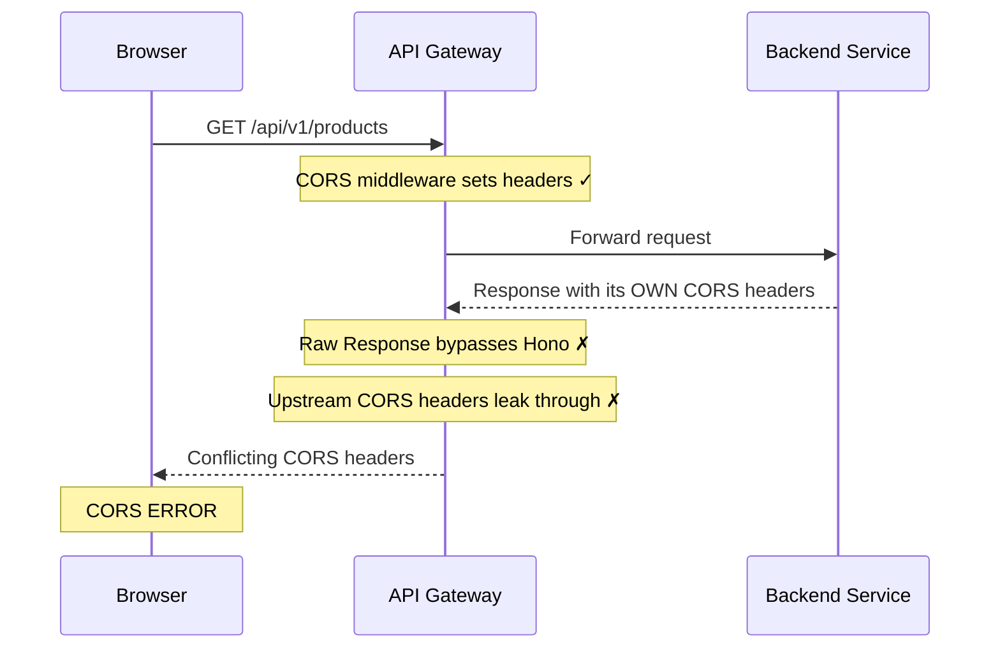
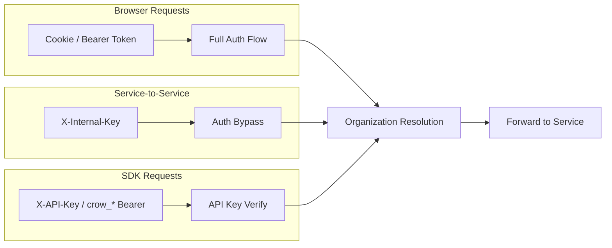
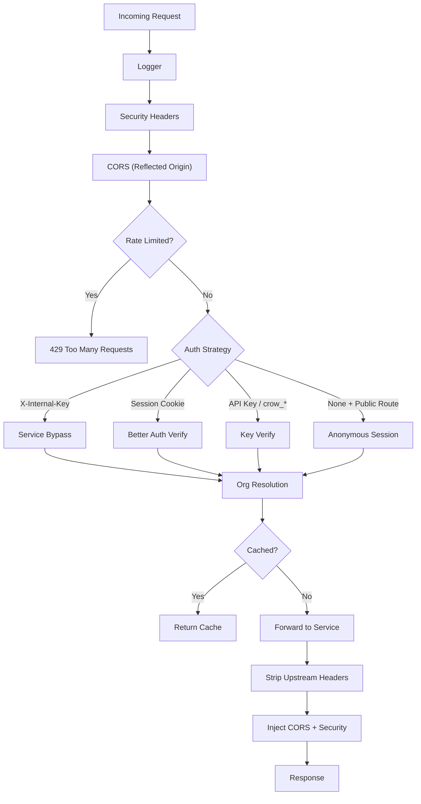

There is a particular kind of madness that comes from staring at a browser console full of red text that reads `Access-Control-Allow-Origin`. It's the kind that makes you question your career, your framework choices, and eventually — at 5:23 PM on a Friday — your decision to use cookies at all.

This is the story of how we built the CROW API gateway. More honestly, it's the story of how CORS, authentication, and the beautiful chaos of microservices conspired to humble us across 62 commits, 7 CORS rewrites, and one afternoon where we pushed 4 commits in 3 minutes — each one contradicting the last.

If you've ever whispered "just let me through" at a preflight request, this one's for you.

## Context: What Is This Gateway?

Before we get into the trenches — some context. **CROW** (Cognitive Reasoning Observation Watcher) is our unified customer interaction intelligence platform. It ingests data from websites, in-store CCTV, and social media, then uses AI to surface actionable insights.

The platform is built as microservices on Cloudflare Workers. At last count, we have **16 services** — auth, users, products, organizations, analytics, notifications, patterns, interactions, chat, QnA, MCP, billing, CCTV, web ingest, social collection, and a crawl service. Each one deployed independently, each one with its own subdomain under `*.crowai.dev`.

The API gateway sits at `api.crowai.dev` and does what gateways do: routes requests to the right service, handles authentication, manages rate limiting, caches responses, and — as it turns out — fights an unending war with the browser's same-origin policy.



We chose [Hono](https://hono.dev/) as the framework — fast, lightweight, built for edge runtimes. Cloudflare KV for caching and rate limiting state. The service registry lives in a constants file that maps URL patterns to backend service URLs.

Simple enough, right?

## Act I: The Garden of Innocence

### January 8, 2026

The first CORS middleware was six lines of config and a dream. We used Hono's built-in `cors()` helper, listed our origins like well-behaved developers, and moved on with our lives:

```typescript
export function createCorsMiddleware(env: Environment) {
  const origins = [
    'https://crowai.dev',
    'https://app.crowai.dev',
    'https://api.crowai.dev',
    'https://dev.crowai.dev',
    'https://dev.app.crowai.dev',
    'https://dev.api.crowai.dev',
  ]

  if (env.ENVIRONMENT === 'local') {
    origins.push(
      'http://localhost:3000',
      'http://localhost:3001',
      'http://localhost:3002',
      'http://localhost:8000',
    )
  }

  return cors({
    origin: origins,
    credentials: true,
    allowMethods: ['GET', 'POST', 'PUT', 'PATCH', 'DELETE', 'OPTIONS'],
    allowHeaders: ['Content-Type', 'Authorization', 'X-Requested-With'],
    maxAge: 86400,
  })
}
```

Six origins. Four localhost ports. `credentials: true` because we needed cookies for session auth. Life was beautiful. The gateway initialized with routing, rate limiting, caching — all the right pieces in all the right places.

We refactored aggressively that week. Eleven commits on January 9th alone — extracting constants, replacing `console.error` with a proper logger, switching from `fetch` to `ky`, building regex-based route patterns with `ts-regex-builder`. The code was clean. The architecture was sound.

We were not yet at war.

## Act II: The Origin Explosion

### February 2, 2026

Services multiply. That's what microservices do — it's right there in the name. And every new service brought a new subdomain. `internal.billing.crowai.dev`. `dev.internal.auth.crowai.dev`. `social-collector.crowai.dev`. Each one needed to talk to the gateway. Each one needed to be in the CORS list.

The origin array grew from 6 to **30+**. The localhost ports expanded from 4 to **12** (ports 8001 through 8012 — one per local service). The CORS middleware, once a thing of elegant simplicity, became a census of our infrastructure:

```typescript
const PROD_ORIGINS = [
  'https://crowai.dev',
  'https://app.crowai.dev',
  'https://api.crowai.dev',
  'https://auth.crowai.dev',
  'https://dashboard.crowai.dev',
  'https://internal.auth.crowai.dev',
  'https://internal.billing.crowai.dev',
  'https://internal.users.crowai.dev',
  'https://internal.products.crowai.dev',
  // ... 20 more origins ...
  'https://dev.internal.billing.crowai.dev',
  'https://dev.internal.auth.crowai.dev',
  // ... and their dev counterparts ...
]
```

Every time we deployed a new service, someone had to remember to add its origin. Every time someone forgot, the browser showed that familiar red wall. We were maintaining a guest list for a party that kept growing, and the bouncer was a preflight request with no sense of humor.

But we didn't know this was merely the appetizer. The real pain was about to begin.

## Act III: The Forwarded Headers Betrayal

### March 5, 2026

Here's the thing about an API gateway: it doesn't just *receive* requests. It *forwards* them. And therein lay the trap.

Hono's `cors()` middleware works beautifully for normal responses — it intercepts the response and injects the right headers. But our `forwardRequest()` function was constructing raw `Response` objects from upstream service responses. These responses bypassed Hono's header injection entirely.

The result? CORS headers were being set by the middleware, then silently overwritten by the raw upstream response. Worse — some upstream services set their *own* CORS headers, which conflicted with ours. The browser received contradictory instructions and did what browsers do: rejected everything.



We had to make a decision: trust the framework, or take control ourselves.

We killed `hono/cors` and wrote a custom middleware from scratch:

```typescript
export function createCorsMiddleware(env: Environment) {
  const allowedOrigins = new Set(
    env.ENVIRONMENT === 'local'
      ? [...PROD_ORIGINS, ...LOCAL_ORIGINS]
      : [...PROD_ORIGINS],
  )

  return async (c: Context, next: Next) => {
    const origin = c.req.header('Origin')
    const isAllowed = origin && origin !== 'null' && allowedOrigins.has(origin)

    // Handle preflight
    if (isAllowed && c.req.method === 'OPTIONS') {
      c.header('Access-Control-Allow-Origin', origin)
      c.header('Access-Control-Allow-Credentials', 'true')
      c.header('Access-Control-Allow-Methods', ALLOW_METHODS)
      c.header('Access-Control-Allow-Headers', ALLOW_HEADERS)
      c.header('Access-Control-Max-Age', '86400')
      c.header('Vary', 'Origin')
      return c.body(null, 204)
    }

    await next()

    // Inject CORS on actual responses — AFTER the forwarded response
    if (isAllowed) {
      c.res.headers.set('Access-Control-Allow-Origin', origin)
      c.res.headers.set('Access-Control-Allow-Credentials', 'true')
      c.res.headers.set('Access-Control-Expose-Headers', EXPOSE_HEADERS)
      c.res.headers.set('Vary', 'Origin')
    }
  }
}
```

And in the forwarding logic, we stripped every CORS header from upstream before our middleware could set the correct ones:

```typescript
const STRIP_RESPONSE_HEADERS = new Set([
  'access-control-allow-origin',
  'access-control-allow-credentials',
  'access-control-allow-methods',
  'access-control-allow-headers',
  'access-control-expose-headers',
  'access-control-max-age',
  'set-cookie',
  'server',
  'x-powered-by',
  'x-internal-key',
  'x-service-api-key',
])
```

This commit was massive. Besides the CORS rewrite, we also:
- Added security headers (HSTS, CSP, X-Frame-Options, nosniff)
- Scoped cache keys by organization to prevent cross-tenant cache poisoning
- Stripped and re-injected internal headers to prevent header injection attacks
- Filtered `crow_*` API keys from being forwarded as Bearer tokens
- Bypassed the rate limiter in dev (a `WorkersKVStore` bug was causing `Date`/`number` type mismatches)

One commit. Seven different problems solved. The kind of commit you write when the levee breaks and you fix everything the floodwater reveals.

## Interlude: The Auth Wars

While CORS held center stage, authentication was waging its own quiet war behind the curtain. A brief digression — because in the browser console, auth bugs and CORS bugs are often indistinguishable.

### The Organization ID That Was Always Null

Our gateway resolves the caller's organization from their session and injects it as `X-Organization-Id` on forwarded requests. The code looked right:

```typescript
// Reading org ID from API key verification
const organizationId = data.key.metadata.organizationId
```

The problem? The auth service returned a *flat* response — `{ organizationId, userId }` — not the nested `data.key.metadata` structure we were reading. The organization ID was always `null`. Every request. For weeks.

The fix, when it came, was defensive to the point of paranoia:

```typescript
const organizationId =
  data.organizationId ?? data.key?.metadata?.organizationId ?? null
const userId = data.userId ?? data.key?.userId ?? null
```

Trust nothing. Check every format. The auth service might change its response shape again, and we've learned not to assume.

### The .env That Shouldn't Have Been

On February 2nd — the same day we expanded CORS origins — we committed a `.env` file containing Cloudflare D1 API tokens, R2 access keys, and database IDs. It sat in the repo for 47 days before we caught it. We rotated everything, moved to `wrangler.jsonc` vars and Wrangler secrets, and added `.env` to `.gitignore` with the fervor of someone who'd touched a hot stove.

### The Service-to-Service Trust Problem

Our `bff-chat-service` needed to call the gateway to fetch product and interaction data for AI tool calls. But it had no user session — it was a service, not a browser. The gateway rejected it.

The fix: an `X-Internal-Key` header bypass. Carry the key, skip auth. The kind of thing you only build after watching a service-to-service call fail in production.



Three auth strategies in one middleware. Each one discovered through failure.

## Act IV: The Slow Drip

### March 8–20, 2026

For two weeks, the CORS origin list grew like weeds after rain. Each fix was a single line — each one preceded by a Slack message that said some variation of "the dashboard is broken."

- **March 8**: `dashboard.crowai.dev` — someone built the dashboard and forgot to tell the gateway.
- **March 9**: `dev.interactions.crowai.dev` — the interaction service URL was wrong AND its origin was missing. Two bugs, one commit.
- **March 20**: `rogue.crowai.dev` — our demo store needed CORS access.

Every new origin was a confession: we'd deployed something and forgotten the guest list. The CORS middleware was becoming a changelog of our infrastructure.

But these were paper cuts. The real wound was coming.

## Act V: The Meltdown

### March 21, 2026 — 5:23 PM Sri Lanka Time

Something broke. We don't remember exactly what triggered it — some new client, some new subdomain, some request from some origin that wasn't in the list. What we remember is the feeling: CORS errors returning like a tide, the origin list that was never complete, the growing certainty that we were playing whack-a-mole with infinity.

What followed was four commits in three minutes. Each one a different philosophy. Each one deployed, tested, and abandoned in under sixty seconds.

**5:23 PM — Commit 1: "fix: allow all origins in CORS for api gateway"**

Nuclear option. We ripped out the entire allowlist and went wildcard:

```typescript
// SCORCHED EARTH
export function createCorsMiddleware() {
  return async (c: Context, next: Next) => {
    if (c.req.method === 'OPTIONS') {
      c.header('Access-Control-Allow-Origin', '*')
      c.header('Access-Control-Allow-Methods', ALLOW_METHODS)
      c.header('Access-Control-Allow-Headers', ALLOW_HEADERS)
      return c.body(null, 204)
    }
    await next()
    c.res.headers.set('Access-Control-Allow-Origin', '*')
  }
}
```

No more origins. No more list. `*` and move on with our lives.

It didn't work. Because `Access-Control-Allow-Origin: *` and `credentials: true` are mutually exclusive. The browser spec says so. Cookies require a specific origin, not a wildcard. Our session-based auth broke instantly.

**5:24 PM — Commit 2: "fix: add dev origins to CORS allowlist in api gateway"**

Panic revert. Back to the allowlist. `credentials: true` restored. We added every origin we could think of.

Still broken. A client we hadn't anticipated. An origin we hadn't listed.

**5:25 PM — Commit 3: "fix: set CORS to allow all origins"**

Back to wildcard. Maybe we could live without cookies? Maybe API keys were enough?

They weren't. The dashboard needed session cookies. The auth flow needed cookies. We needed credentials.

**5:26 PM — Commit 4: "fix: add dev origins to CORS allowlist in api gateway"**

Back to the list. Again. But this time we removed the environment check — every origin, prod and local, in every environment. No more `if (env.ENVIRONMENT === 'local')` gate. Throw everything at the wall.


Then silence. An hour and seventeen minutes of it. We went for a walk. We stared at the RFC. We read what other people do.

## Act VI: The Resolution

### March 21, 2026 — 6:43 PM

The answer, when it came, was embarrassingly simple. Don't maintain a list. Don't use a wildcard. Just *reflect the origin back*.

Whatever origin the browser sends — echo it in `Access-Control-Allow-Origin`. It works with credentials. It works with any subdomain. It works with origins that don't exist yet, origins we haven't deployed, origins that are born at 3 AM when someone spins up a new service and forgets to tell anyone.

```typescript
export function createCorsMiddleware() {
  // WARNING: Reflected origin with credentials — only safe for internal APIs
  // where you control every client. External APIs must validate origins.
  return async (c: Context, next: Next) => {
    const origin = c.req.header('Origin') || '*'

    if (c.req.method === 'OPTIONS') {
      c.header('Access-Control-Allow-Origin', origin)
      c.header('Access-Control-Allow-Credentials', 'true')
      c.header('Access-Control-Allow-Methods', ALLOW_METHODS)
      c.header('Access-Control-Allow-Headers', ALLOW_HEADERS)
      c.header('Access-Control-Expose-Headers', EXPOSE_HEADERS)
      c.header('Access-Control-Max-Age', '86400')
      c.header('Vary', 'Origin')
      return c.body(null, 204)
    }

    await next()

    c.res.headers.set('Access-Control-Allow-Origin', origin)
    c.res.headers.set('Access-Control-Allow-Credentials', 'true')
    c.res.headers.set('Access-Control-Expose-Headers', EXPOSE_HEADERS)
    c.res.headers.set('Vary', 'Origin')
  }
}
```

No `env` parameter. No origin set. No list to maintain. Twenty-three lines that replaced 73 days of accumulating infrastructure.

> **A word on security:** Unvalidated reflected origin with `credentials: true` means *any* website can make authenticated cross-origin requests to your API. This is only acceptable because our gateway is an internal service — every client that talks to it is ours. If you're building a public-facing API, **do not do this**. Validate the origin against a trusted list (or a pattern like `*.yourdomain.com`) before reflecting it back. The reflected-origin pattern trades origin validation for operational simplicity. That trade only makes sense when you own both sides of the conversation.

The `Vary: Origin` header tells caches that responses differ by origin — so a CDN or shared cache won't serve one client's CORS headers to another. This is about cache correctness, not security. The security boundary is whether you validate the origin before reflecting it. For us, the gateway sits behind Cloudflare's edge, every client is a `*.crowai.dev` subdomain we control, and the real authorization happens in the auth middleware — not in CORS.

And note the fallback: `c.req.header('Origin') || '*'`. Non-browser requests (cURL, Postman, service-to-service) don't send an `Origin` header. For those, we fall back to wildcard, which is fine — they don't enforce CORS anyway.

We deployed. We tested. Dashboard worked. Auth worked. SDK worked. Rogue store worked. Every service, every subdomain, every localhost port.

The war was over.

## Epilogue: The Last Header

### March 22, 2026

Of course it wasn't quite over. The morning after the armistice, SDK requests from embedded scripts started failing. The preflight was rejecting them — not because of the origin, but because of a header.

The SDK sends authentication via `X-API-Key`. Our `Access-Control-Allow-Headers` didn't include it. The browser's preflight check saw an unlisted header and blocked the request.

One line:

```diff
- const ALLOW_HEADERS = 'Content-Type,Authorization,X-Requested-With'
+ const ALLOW_HEADERS = 'Content-Type,Authorization,X-Requested-With,X-API-Key'
```

And a related fix in the forwarding logic — we'd been stripping all `crow_*` Bearer tokens as a security measure (preventing API keys from leaking to upstream services). But the web ingest service *needed* the SDK's API key. We added a targeted exception:

```typescript
function extractAuthenticationToken(context, isApiKeyPassthrough) {
  const rawBearer = context.req.header('Authorization')
    ?.startsWith('Bearer ')
    ? context.req.header('Authorization')!.slice(7).trim()
    : undefined

  // Allow crow_* tokens through to ingest service specifically
  if (rawBearer?.startsWith('crow_') && isApiKeyPassthrough) return rawBearer

  const originalBearer =
    rawBearer && !rawBearer.startsWith('crow_') ? rawBearer : undefined
  return originalBearer || context.get('token')
}
```

Security and accessibility, forever in tension. You strip headers to prevent leaks, then carve exceptions for the services that need them. Every rule has its exception, and every exception has its edge case.

## Key Learnings

### 1. Framework CORS helpers break with proxied responses

If your gateway forwards requests, the framework's CORS middleware likely won't inject headers on the forwarded response. You need to handle it yourself — strip upstream CORS headers, set your own after `await next()`.

### 2. Wildcard and credentials are enemies

`Access-Control-Allow-Origin: *` with `Access-Control-Allow-Credentials: true` is a browser spec violation. If you need cookies, you need a specific origin. We learned this twice in the same three minutes.

### 3. Reflected origin is the endgame — for internal APIs

For internal gateways where you control all the clients, reflecting the `Origin` header back is the simplest correct solution. **But only if you trust every possible caller.** For public APIs, validate the origin first — check it against a pattern like `*.yourdomain.com` — then reflect if trusted. Set `Vary: Origin` so caches don't cross-contaminate responses across origins. No list to maintain. No deployments to remember. Just make sure you understand the trust boundary you're operating in.

### 4. Auth bugs and CORS bugs look identical

A 403 from your auth middleware and a CORS rejection both manifest as "the request failed." Half the time we were debugging CORS, the actual bug was in auth — wrong response format, missing headers, null org IDs. Instrument your gateway. Log the actual failure, not just the symptom.

### 5. Your origin list is your infrastructure changelog

Before reflected origin, every new origin we added was a confession that we'd deployed something and forgotten to update the gateway. If your CORS config is a growing list, that list is telling you something about your process.

### 6. Security and accessibility are a perpetual negotiation

We stripped internal headers to prevent leaks, then had to add exceptions for services that needed them. We blocked API keys from forwarding, then had to let them through for ingest. Every security rule creates a usability gap, and every exception creates a security gap. The art is in finding the narrowest exception that solves the problem.

## The Final Architecture

After 62 commits, 7 CORS rewrites, an afternoon meltdown, and more auth bugs than we care to count, here's what the gateway middleware chain looks like today:



It routes 16 services. It handles three auth strategies. It rate-limits at different tiers per route type. It caches with organization-scoped keys. And its CORS middleware is 23 lines of reflected-origin simplicity that hasn't needed a single change since March 21st.

The gateway doesn't look like what we imagined on January 8th. It looks like what 62 commits of reality taught us. Sometimes the battle is the architecture.

---

*Questions about our gateway setup or war stories from your own CORS battles? Check out our repos and feel free to open an issue.*

## Related Repositories

- **[core-api-gateway](https://github.com/CROW-B3/core-api-gateway)** — The gateway itself (private, but you've read the best parts)
- **[core-auth-service](https://github.com/CROW-B3/core-auth-service)** — The auth service that kept breaking in new ways
- **[web-ingest-service](https://github.com/CROW-B3/web-ingest-service)** — The ingest worker that needed the API key exception
