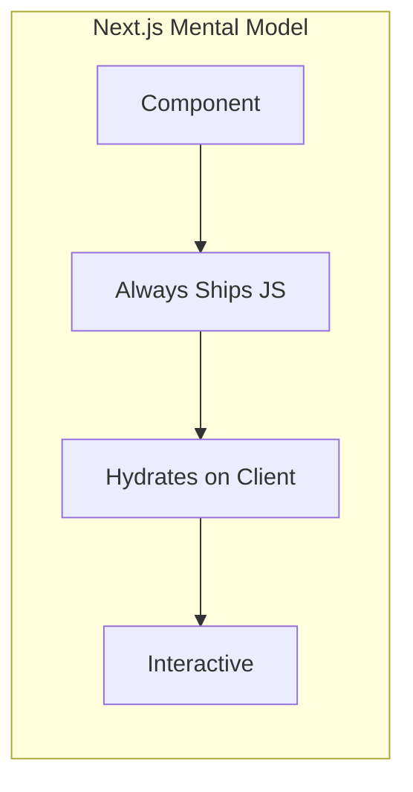
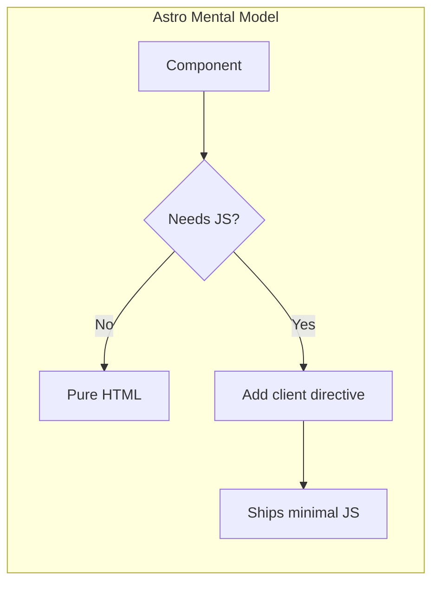
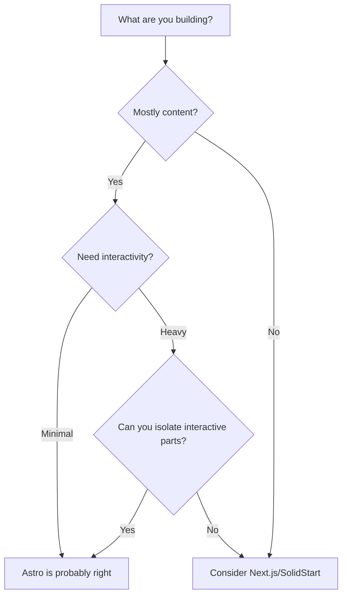

We finally did it. After months of staring at Lighthouse scores that made us question our life choices, we migrated our marketing site from Next.js to Astro. This is the story of why we made that decision, the painful lessons we learned, and why Cloudflare's recent acquisition of Astro made us feel slightly less insane for betting on it.

## The Problem: Our Site Was Slow (And We Didn't Know Why)

Let's be honest—our Next.js site wasn't terrible. It worked. It rendered. Users could click things. But every time we ran Lighthouse, we'd see numbers that felt... off. 230 KB of JavaScript for what was essentially a marketing site with some forms. 31-second build times that had us alt-tabbing to Twitter more than we'd like to admit.

The thing that really got us was when a friend asked: "Why does the pricing page need React to display static text?"

We didn't have a good answer.

## The Mental Model Shift

Here's what took us embarrassingly long to understand:





In Next.js, we were paying the "React tax" on every single component. Even our footer. Even our "About Us" page that literally just displays text. The framework assumed everything needed to be interactive, and we never questioned it.

Astro flipped this completely. Nothing is interactive unless you explicitly say so. At first, this felt restrictive—like going from an automatic car to manual. But once it clicked, we couldn't unsee the waste in our old approach.

## The Slow Realization

The migration wasn't a weekend project. It wasn't even a two-week sprint. We spent a genuinely painful amount of time:

1. **Auditing our components** - Turns out, most of them didn't actually need JavaScript. That fancy navigation component? It was using React state for... a CSS class toggle. We could have done that with 3 lines of vanilla JS. Or, you know, just CSS.

2. **Unlearning React patterns** - We kept reaching for `useState` like a reflex. "I need to show/hide this thing, so obviously I need sta—" No. Stop. It's just HTML with a checkbox hack or a `<details>` element.

3. **Fighting our own instincts** - Coming from Next.js, we didn't trust server rendering in Astro. We kept adding `client:only` everywhere "just to be safe." This was completely wrong, but it took us weeks to accept that.

## The "Aha" Moments

### Moment 1: Buttons Don't Need JavaScript

This sounds obvious in retrospect, but it genuinely took us a while:

```astro
<!-- We were doing this (shipping React for a link) -->
<Button onClick={() => router.push('/pricing')}>View Pricing</Button>

<!-- When we could just do this -->
<a href="/pricing" class="button">View Pricing</a>
```

If your "button" just navigates somewhere, it's not a button. It's a link. The browser has handled links for 30 years. It's pretty good at it.

### Moment 2: Islands Actually Make Sense

We'd heard about "island architecture" but dismissed it as academic nonsense. Then we saw this pattern in our own code:

```astro
<!-- Before: The entire section ships with React -->
<PricingSection client:load>
  <h2>Pricing Plans</h2>
  <p>Choose the plan that works for you.</p>
  <PricingToggle /> <!-- Only THIS needs JS -->
  <PricingCards />
</PricingSection>
```

We were shipping JavaScript for headings. *Headings*. The fix was almost embarrassing:

```astro
<!-- After: Static HTML with one interactive island -->
<section>
  <h2>Pricing Plans</h2>
  <p>Choose the plan that works for you.</p>
  <PricingToggle client:visible />
  <PricingCards />
</section>
```

### Moment 3: client:visible Is Magic

Lazy loading components based on viewport visibility felt like cheating. Our below-the-fold interactive elements now only load when users actually scroll to them:

```astro
<!-- JS only loads when this enters the viewport -->
<InteractiveDemo client:visible />
<TestimonialCarousel client:visible />
<ContactForm client:visible />
```

This single pattern probably saved us 40% of our initial JavaScript payload.

## The Mistakes (So You Don't Repeat Them)

### Mistake 1: client:only Everywhere

Our first Astro implementation was arguably worse than Next.js because we used `client:only` on everything. We didn't understand that Astro could server-render React components—we assumed they'd break somehow.

The result? No SSR, terrible SEO, layout shift everywhere, and hydration errors we didn't understand.

**What we learned:** `client:only` is for components that literally cannot render on the server (canvas, WebGL, stuff that needs `window`). For everything else, let Astro do its thing.

### Mistake 2: Not Trusting the Framework

We added so many "safety" hydration directives that we recreated the Next.js problem in Astro. The fix was counterintuitive: delete most of our `client:*` directives and only add them back when things actually broke.

Spoiler: most things didn't break.

### Mistake 3: Over-Engineering Simple Interactions

Our mobile nav toggle was a React component with `useState`, `useEffect`, and `useCallback`. The Astro version?

```html
<button onclick="document.getElementById('menu').classList.toggle('open')">
  Menu
</button>
```

Sometimes the old ways are the good ways.

## Why Cloudflare Acquiring Astro Matters

Let's address the elephant in the room: betting on a framework is always a gamble. We've all been burned by projects that looked promising and then... didn't.

When [Cloudflare acquired Astro](https://astro.build/blog/astro-joins-cloudflare/) on January 16, 2026, it genuinely changed our risk calculus. This wasn't just another VC-funded framework that might pivot to AI chatbots next quarter. Cloudflare has infrastructure. They have a business model that benefits from fast, efficient websites. Their incentives align with making Astro better at what it already does well.

Does this guarantee Astro's future? No. But it made us feel significantly less nervous about building on it.

## The Numbers (Because You're Scrolling For Them)

Here's what our migration actually achieved:

| Category | Metric | Astro | Next.js | Delta |
|----------|--------|-------|---------|-------|
| **Build** | Build Time | 6.93s | 31.1s | 4.5x faster |
| | Output Size | ~50 MB | ~892 MB | 94% smaller |
| **JavaScript** | Total JS | 84 KB | 230 KB | 63% less |
| | JS Execution | 1.6s | 3.4s | 53% faster |
| | Main Thread Work | 3.4s | 8.2s | 59% less |
| | Unused JS | ~25 KB | ~69 KB | 64% less |
| **Core Web Vitals** | LCP | 2.8s | 3.8s | 26% faster |
| | TBT | 0ms | 230ms | Eliminated |
| | TTI | 2.8s | 3.8s | 26% faster |

The build time improvement alone was worth it. Going from 31 seconds to 7 seconds doesn't sound dramatic until you realize how many times a day you run builds. Those 24 seconds add up to hours of reclaimed focus time.

## The Trade-offs (Because Nothing Is Free)

We'd be lying if we said Astro won every metric:

- **First Contentful Paint** is slower (2.7s vs 1.1s). Next.js's aggressive pre-rendering gets pixels on screen faster, even if those pixels aren't interactive yet.
- **Speed Index** favors Next.js (2.8s vs 5.1s). The page "looks" complete sooner in Next.js, even though users can interact with Astro sooner.
- **Ecosystem maturity** - Next.js has more tutorials, more Stack Overflow answers, more everything. When we hit edge cases in Astro, sometimes the answer was "read the source code."

For our use case—a content-heavy marketing site—these trade-offs were acceptable. For a highly interactive dashboard? We'd probably stick with Next.js or look at something like SolidStart.

## The Decision Framework

After going through this, here's how we'd think about the choice:



## Final Thoughts

Migrating from Next.js to Astro wasn't about frameworks being "good" or "bad." It was about picking the right tool for what we were actually building. We were using a sports car to go grocery shopping—technically it works, but a sensible hatchback would've been fine.

The migration forced us to think about JavaScript in a way we'd been avoiding for years. Every `client:` directive is now a conscious decision, not a default. Every kilobyte of JS shipped has a reason.

Is Astro perfect? No. Is it the right choice for everything? Absolutely not. But for content-focused sites that don't need the full weight of a React application, it's been a genuine improvement—both in performance and in how we think about building for the web.

Now if you'll excuse us, we have 24 more seconds per build to figure out what to do with.
