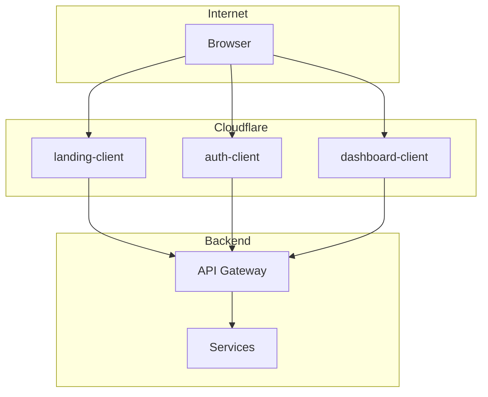
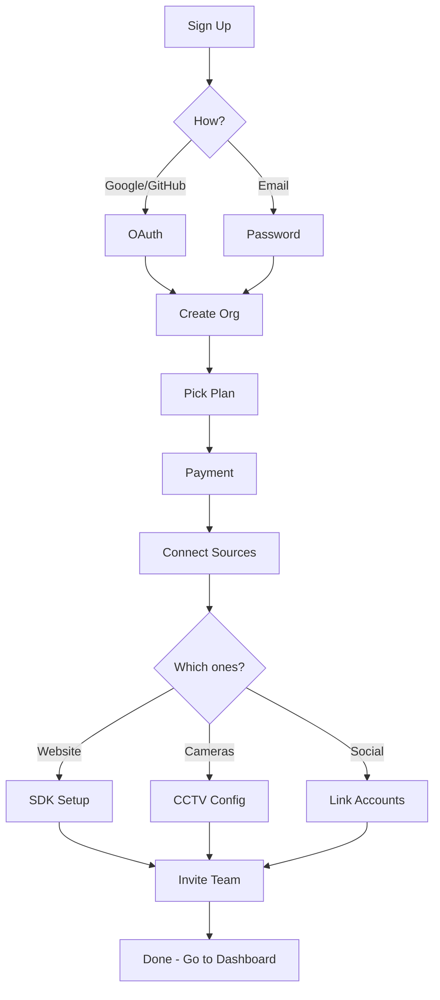
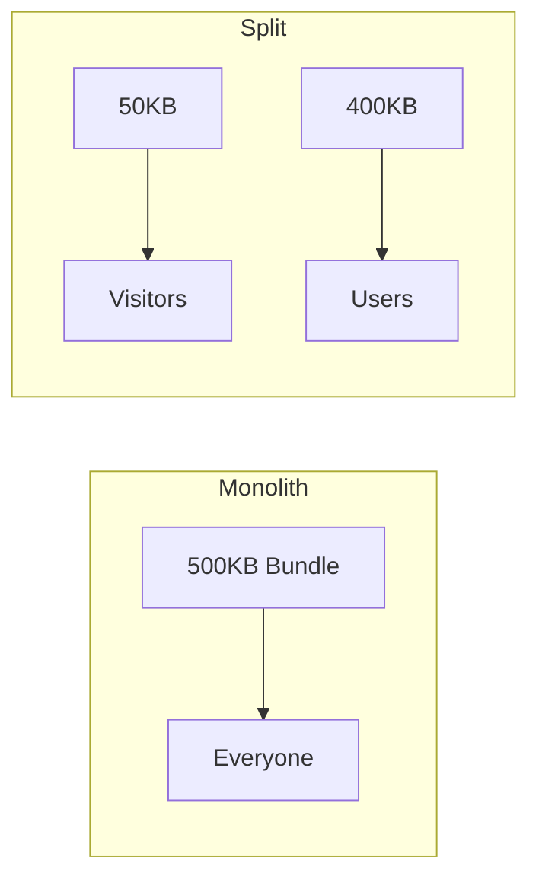
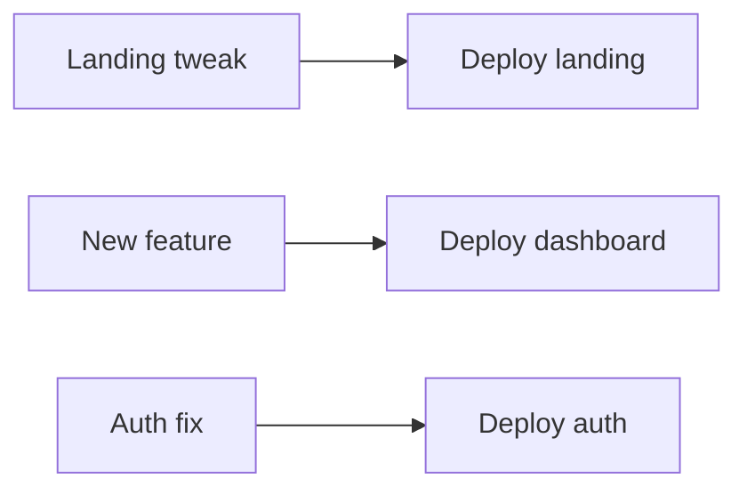
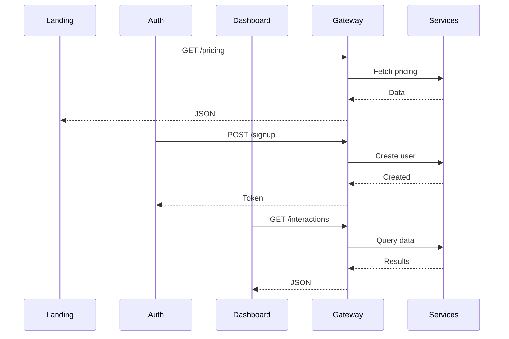
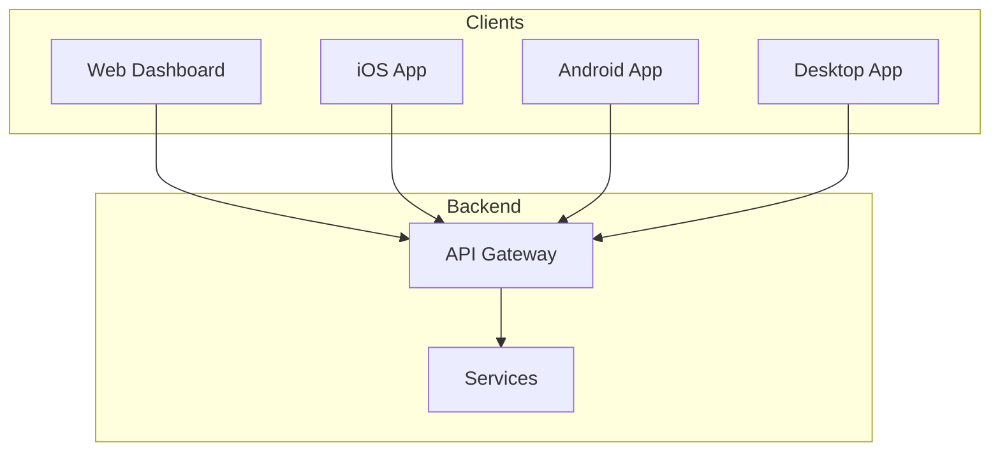

When we kicked off CROW, the default choice was obvious: one big Next.js app that handles everything. Marketing pages, login flows, the dashboard - all in one neat monorepo. Every tutorial does it that way, and honestly, it's the easiest thing to set up on day one.

We didn't do that. Instead, CROW runs on three completely separate frontend applications. Each one gets deployed on its own, has its own repo, and talks to our backend independently. Sounds like overkill? Maybe. But even this early on, we're already seeing the benefits - especially as we start thinking about mobile and desktop apps down the line.

Let me walk you through how we got here.

## Quick Background on CROW

If you haven't read our other posts: **CROW** is an analytics platform that pulls in customer interaction data from a bunch of different sources - website behavior, CCTV footage in physical stores, social media mentions. We crunch all that with AI and give businesses a unified view of how people interact with their brand.

The frontend has to do three pretty different jobs:

1. **Sell the product** - Marketing pages, pricing, "look how cool this is" stuff
2. **Get people set up** - Sign up, create an org, connect data sources, invite your team
3. **Be the daily driver** - The actual dashboard where users spend their time

If you think about it, these are totally different contexts. Someone browsing our pricing page has completely different needs than someone knee-deep in analytics data.

## How It's Actually Structured

Here's the bird's eye view:



Three Next.js apps. Three Cloudflare Workers deployments. They share our component library (`@b3-crow/ui-kit`) so they look consistent, but otherwise they're independent.

### landing-client

This is our marketing site. The stuff you see before you've decided to sign up.

**What's in it:**
- Homepage with all the flashy stuff
- Pricing page
- Feature breakdowns
- "Coming soon" pages for stuff we haven't shipped yet

```
landing-client/src/app/
├── coming-soon/
├── globals.css
├── layout.tsx
└── page.tsx
```

The whole point here is speed. We want this thing to load *fast*. Every KB of JavaScript is a KB that makes first impressions worse. So we keep it dead simple - mostly static content, minimal client-side code, aggressive caching.

Target: under 500ms to first paint. We're hitting that pretty consistently.

### auth-client

This one handles everything from "I want to sign up" to "okay I'm ready to use the product." It's basically a multi-step wizard:



The folder structure maps directly to this flow:

```
auth-client/src/app/
├── page.tsx              # Sign up form
├── organization/         # Create your org
├── choose-plan/          # Starter, Pro, Enterprise
├── checkout/             # Stripe integration
├── connect-sources/
│   ├── web/             # SDK install instructions
│   ├── cctv/            # Camera setup
│   └── social/          # OAuth connections
├── invite-team/          # Email invites
└── accept-invite/        # For people receiving invites
```

This is the most form-heavy part of our whole frontend. Lots of validation (we use Zod everywhere), lots of error handling, lots of state to track. The bundle is bigger than the landing page, but by this point people have committed to signing up - they'll wait an extra second.

### dashboard-client

Where users actually live once they're set up. Analytics, the AI chat interface, settings, all of that.

```
dashboard-client/src/app/
├── globals.css
├── layout.tsx
└── page.tsx
```

This is the heaviest app by far. Charts, real-time updates, complex interactions. We're okay with that because:
- Users are logged in and invested
- They're going to spend hours here, not seconds
- Some features (like our chat interface) just need a lot of code

We aim for under 2 seconds time-to-interactive. For a workspace app, that's fine.

## Why Bother Splitting?

Okay, so why go through all this trouble? Here's what actually drove the decision:

### You Ship Different Code to Different People

With one app, everyone downloads everything. Marketing visitor? Here's 400KB of dashboard code you'll never use. Dashboard user? Here's all our marketing animations.

With separate apps:



Our landing page ships about 50KB. That's a 10x difference for someone just checking out the pricing page.

### Deploys Don't Step on Each Other

Someone's tweaking the landing page copy. Someone else is halfway through a big dashboard feature. And you just noticed a bug in the login flow that needs fixing now.

With one app, all of this goes through the same pipeline and you're stepping on each other's toes. With three apps:



Smaller deploys. Less risk. No "wait, we can't ship the typo fix because someone's PR isn't ready yet."

### Security Gets Easier

Auth code is sensitive. By putting it in its own app, we've got a clear boundary:
- Landing page literally cannot access auth tokens (different app, different code)
- Dashboard only gets tokens after auth-client says so
- When we do security reviews, the auth surface is contained

### People Can Own Things

Someone can own "the landing page" or "the onboarding flow" without having to understand the entire codebase. Clear boundaries = less stepping on each other = faster shipping.

### Performance Budgets Actually Work

We want different Lighthouse scores for different apps:

| App | First Paint | TTI | Lighthouse |
|-----|-------------|-----|------------|
| landing-client | < 0.5s | < 1s | 95+ |
| auth-client | < 1s | < 2s | 90+ |
| dashboard-client | < 1s | < 2s | 85+ |

With separate repos, we can enforce this in CI. Each app has its own performance budget. Try doing that cleanly in a monolith.

## How We Deploy This

Everything goes to Cloudflare Workers via OpenNext. Why Workers?

**It's everywhere** - 300+ edge locations. Users connect to whatever's closest.

**No cold starts** - V8 isolates spin up in milliseconds. None of that Lambda "hope it's warm" stuff.

**Caching just works** - KV for ISR, automatic cache invalidation, the whole deal.

Each app has its own wrangler config:

```toml
# landing-client/wrangler.toml
name = "crow-landing-client"
main = ".open-next/worker.js"
compatibility_date = "2024-11-01"

[[kv_namespaces]]
binding = "NEXT_CACHE_WORKERS_KV"
id = "..."
```

Deploy one app, the others don't even know about it.

## The API Gateway Glue

With three frontends, we needed one clean backend interface. So all three apps talk to the same API gateway:



Gateway handles auth, rate limiting, routing - all that stuff. Frontends just make HTTP calls.

This is actually the key thing that makes everything else work.

## Why This Matters for Mobile and Desktop

Here's where it gets interesting. We're planning native apps:
- iOS (Swift)
- Android (Kotlin)
- Desktop (probably Tauri)

With a monolithic web app, adding native clients would be painful. You'd have to extract all the API logic, figure out what can be shared, probably rewrite a bunch of stuff.

With our setup? Native apps are just more boxes in this diagram:



The API already exists. It already handles everything the dashboard needs. Mobile apps just... use it.

Our ui-kit package also exports validation schemas, TypeScript types, and API client utilities. For React Native, we can reuse a ton of that. We basically set ourselves up for this by accident - splitting the frontend forced us to extract shareable stuff early.

Even auth flows transfer pretty cleanly. OAuth works via system browser on mobile. Token storage moves to Keychain/Keystore. The actual flow logic? Same as web.

## The Downsides (Being Honest)

This isn't free. Here's what's annoying:

**Navigation between apps is a full page load.** Going from landing to auth means loading a whole new app. We mitigate this with fast deploys and consistent design, but it's not as smooth as client-side routing.

**Auth state syncing is fiddly.** Cookies need to work across subdomains. Token refresh logic lives in each app. Redirects pass state through URLs. It works, but there's more surface area for bugs.

**Local dev is more complex.** Running everything means three terminal tabs. We've got scripts, but it's still more hassle than `npm run dev`.

**Some changes need coordinated deploys.** API changes, shared component updates - sometimes you need to deploy things in order. Feature flags help.

## What We Learned

**Think about user journeys first.** We didn't start with "let's split the frontend." We started with "marketing visitors, onboarding users, and daily users have different needs." The architecture followed.

**Shared components are non-negotiable.** Without ui-kit, we'd have three apps that look slightly different and drift over time. Invest in shared infrastructure early.

**API-first pays off later.** We designed our API for the dashboard's needs. Turns out that's the same as "any client's needs." Mobile was almost free.

**Edge deployment makes this viable.** If each app needed its own server cluster, the ops overhead would kill us. Cloudflare Workers means three apps cost basically the same as one.

**Enforce your performance budgets.** Different apps having different targets only works if CI actually fails when you miss them.

## Wrapping Up

Three apps instead of one was definitely more work upfront. Three repos, three pipelines, three sets of dependencies to keep updated.

But we're already shipping faster than we would with a monolith. Deploys are smaller and safer. We're not blocking each other. And when we start on mobile apps, most of the hard work is already done.

The monolith path optimizes for getting started quickly. The split path optimizes for where you're headed.

If you're building something that needs to work across multiple platforms, scale with your team, or serve users with genuinely different needs - maybe don't take the default path just because it's easier on day one.

---

*Curious about the details? All our frontend repos are open:*

- **[landing-client](https://github.com/CROW-B3/landing-client)** - Marketing site
- **[auth-client](https://github.com/CROW-B3/auth-client)** - Onboarding flows
- **[dashboard-client](https://github.com/CROW-B3/dashboard-client)** - Main workspace
- **[ui-kit](https://github.com/CROW-B3/ui-kit)** - Shared components
