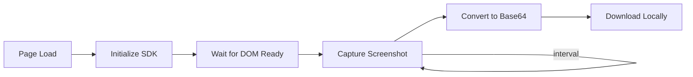
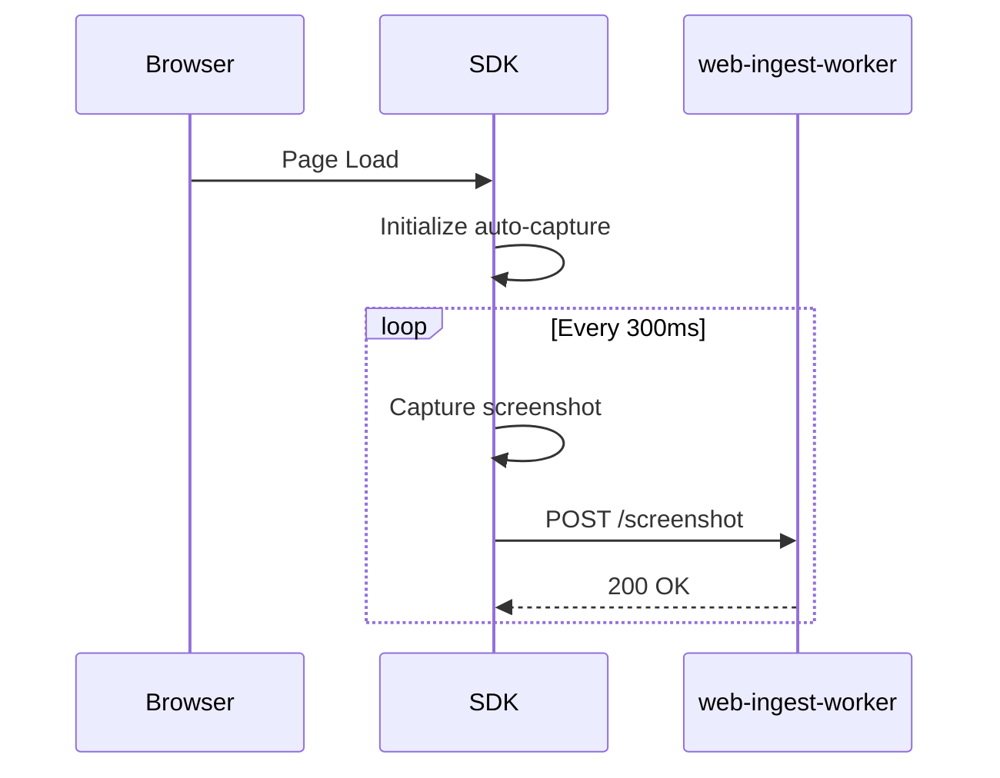
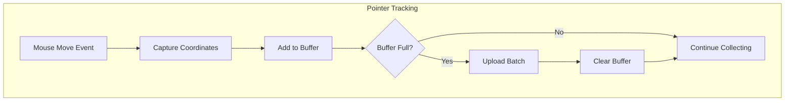
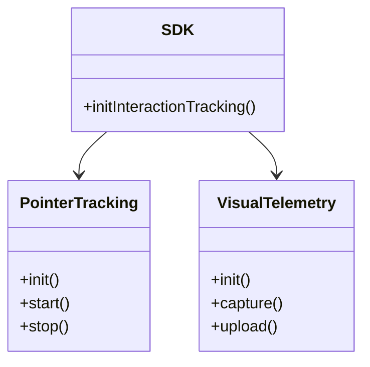
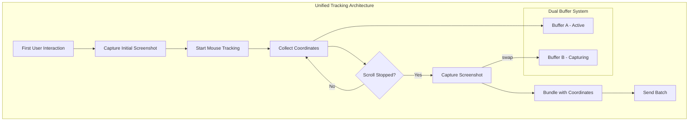
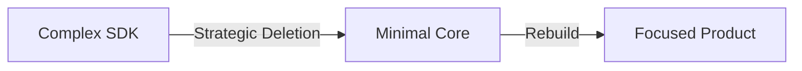
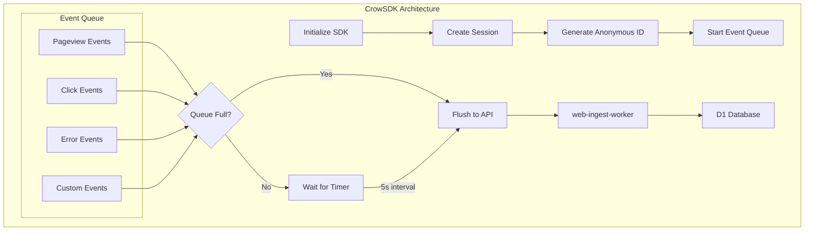
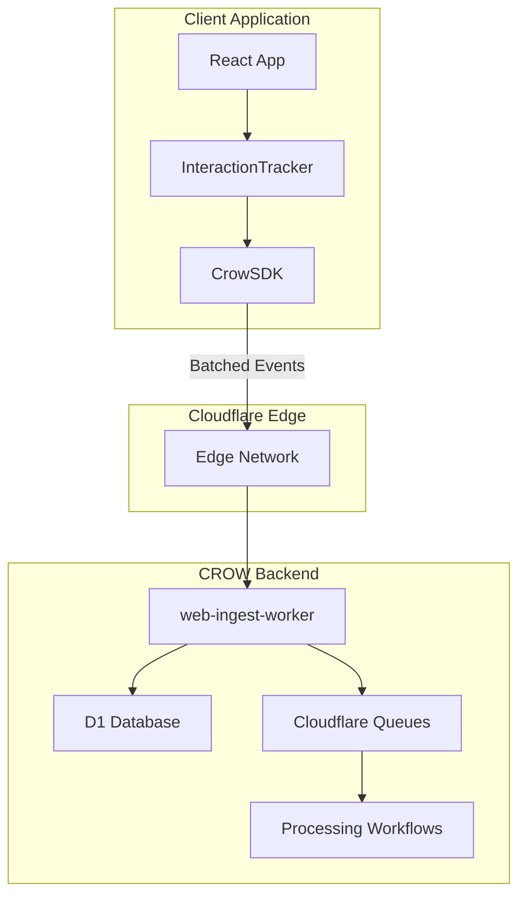

This post documents the development journey of our [`@b3-crow/website-hook-sdk`](https://github.com/CROW-B3/website-hook-sdk) - the approaches we tried, what worked, what didn't, and the reasoning behind our architectural decisions. If you're building client-side tracking SDKs or just curious about iterative development in practice, this one's for you.

## Context: What is CROW?

Before diving into the technical details, let me give you some context. **CROW** (Cognitive Reasoning Observation Watcher) is a unified customer interaction intelligence platform we're building at B3. The platform ingests data from multiple channels - website interactions, in-store experiences via CCTV, and social media - then uses AI to surface actionable insights.

The website-hook-sdk is a core piece of our Website Interaction Tracking system. It lives on client websites and sends user behavior data to our [web-ingest-worker](https://github.com/CROW-B3/web-ingest-worker) running on Cloudflare's edge network. From there, the data flows through processing pipelines and eventually ends up in our analytics dashboard.

We also have a test bed called [rogue-store](https://github.com/CROW-B3/rogue-store) - an e-commerce demo site where we test SDK integrations in a realistic environment.

## The Initial Vision

We started with ambitious plans: build a session replay system like FullStory or Hotjar. Capture screenshots, track mouse movements, reconstruct exactly what users were doing. The kind of feature that sounds impressive in a pitch deck.

The final product looks nothing like that. Here's the full story of how we got there.

## Phase 1: Screenshot Capture (December 2, 2025)

Our first implementation focused on visual capture using `html2canvas`. The approach was straightforward - capture the DOM as an image at regular intervals:



The core implementation:

```typescript
export class ScreenshotCapture {
  async capture(): Promise<string> {
    await this.waitForPageLoad();
    const canvas = await html2canvas(document.body, {
      useCORS: true,
      quality: 0.92,
      backgroundColor: '#ffffff',
    });
    return canvas.toDataURL('image/png');
  }
}
```

**What worked:**
- Screenshot capture was accurate and reliable
- CORS handling for external images worked well
- Quality and format options provided flexibility

**What didn't:**
- File sizes were substantial - we're talking megabytes per screenshot
- Local download wasn't useful for analytics purposes
- No server-side component to actually process the data

We had screenshots. We just couldn't do anything useful with them yet.

## Phase 2: Edge Worker Integration (December 2-3, 2025)

Next step: get those screenshots to our backend. We upgraded to `html2canvas-pro` and implemented automatic capture with uploads to our Cloudflare Worker:



During this phase, we made a key decision: remove the delay concept. The original implementation had artificial delays before starting captures - the idea was to "be gentle" on the browser. In practice, this just added complexity. If someone configures a 100ms interval, that's what they should get.

We also caught an embarrassing bug: the interval was hardcoded to 100ms regardless of what the configuration said.

```typescript
// The bug - config was completely ignored
setInterval(() => this.capture(), 100);

// The fix - actually use the configured value
setInterval(() => this.capture(), this.config.interval);
```

Always test that your configuration actually affects behavior. It's an easy thing to miss.

## Phase 3: Pointer Tracking (December 3, 2025)

Screenshots alone weren't telling us enough. We needed to understand where users were looking and clicking. This led to implementing pointer coordinate tracking with a batching system:



The initial configuration was aggressive - 15ms batch intervals with up to 100 coordinates per batch. Network inspection revealed constant outbound requests. Our browser dev tools were practically on fire. We adjusted to 1-second intervals, which significantly reduced overhead while maintaining useful granularity.

Important decision at this point: we made screenshot capture optional. Many use cases only needed pointer data, and the bandwidth savings from skipping screenshots were substantial.

## Phase 4: API Simplification (December 5, 2025)

Technical debt was accumulating. The SDK had too many configuration options, and everyone integrating it kept asking "what settings should we use?"

We made a deliberate choice: hardcode sensible defaults and minimize configuration surface area.

```typescript
// Before - multiple decisions required
initAutoCapture({
  interval: 300,
  quality: 0.92,
  viewportOnly: true,
  useCORS: true,
  backgroundColor: '#ffffff',
  pointerTracking: {
    enabled: true,
    batchInterval: 1000,
    maxBatchSize: 100,
  }
});

// After - minimal configuration
initInteractionTracking({ logging: false });
```

The reasoning: most users wanted identical settings. The small minority who needed customization could fork the SDK. Reducing configuration complexity improved the integration experience for the majority.

We also renamed `interaction-tracking` to `pointer-tracking`. The name was more accurate - the module tracks pointer movements, not abstract "interactions." Naming matters for maintainability.

## Phase 5: Architecture Organization (December 7-22, 2025)

The codebase needed structure. We organized code into namespaces and made several technical improvements:



Key changes during this phase:
- **Replaced fetch with ky**: Better retry logic and cleaner API
- **Implemented fire-and-forget uploads**: Analytics should never block the user experience
- **Centralized URL configuration**: Single source of truth for endpoints
- **Extracted common utilities**: Reduced code duplication

The fire-and-forget pattern is worth emphasizing:

```typescript
// Analytics failures should be silent
function uploadBatch(data: PointerCoordinate[]): void {
  ky.post(UPLOAD_ENDPOINT, { json: data }).catch(() => {
    // Silent failure - user experience takes priority
  });
}
```

This is critical for analytics SDKs. If tracking fails, the user's application continues working normally. Our data collection is secondary to their user experience.

## Phase 6: Unified Tracking System (December 25, 2025)

We attempted to build something sophisticated: a system that synchronized screenshots with pointer data. The concept was to capture a screenshot when scrolling stops, bundle it with collected mouse coordinates, and ship as a unified batch.



The implementation included:
- Dual-buffer pattern to prevent data loss during async screenshot operations
- Mutex for preventing concurrent screenshot captures
- Scroll detection for intelligent screenshot timing
- Buffer overflow protection
- Maximum batch timeout safeguards

Technically, this was sophisticated work. But we were building session replay functionality - which wasn't what our users actually needed.

## Phase 7: The Reset (December 27, 2025)

Two days after building the unified tracking system, we made a significant decision: delete it.

We removed:
- Visual telemetry module (screenshot capturing)
- Pointer tracking module (mouse movement)
- Interaction tracking wrapper
- html2canvas-pro dependency

Total: 781 lines of code removed.



**The reasoning:** We had lost sight of actual requirements. Looking at our internal documentation for [Website Interaction Tracking](https://github.com/CROW-B3/internal-docs), what our users needed was understanding behavior patterns - pageviews, clicks, conversion events. The fundamentals. Session replay was technically interesting but wasn't solving the real problem.

Deleting working code is difficult. But maintaining unnecessary complexity has ongoing costs - in bugs, in cognitive load, in documentation. Sometimes deletion is the right move.

## Phase 8: Event-Centric Architecture (December 30, 2025)

Three days later, we shipped a fundamentally different architecture centered on events and sessions. This aligned with what our internal docs describe - a lightweight SDK that automatically tracks common events and supports custom event tracking.



The new `CrowSDK` class:

```typescript
export class CrowSDK {
  private config: Required<CrowConfig>;
  private eventQueue: EventQueue;
  private sessionId: string;
  private anonymousId: string;

  constructor(config: CrowConfig) {
    this.sessionId = getSessionId();
    this.anonymousId = getAnonymousId();

    this.eventQueue = new EventQueue(
      config.batching?.maxBatchSize ?? 10,
      config.batching?.flushInterval ?? 5000,
      (events) => this.sendBatch(events)
    );
  }
}
```

**Core capabilities:**

1. **Session Management**: Persistent session IDs via localStorage, permanent anonymous IDs across sessions
2. **Event Batching**: Events queue and send together, reducing network requests significantly
3. **Auto-capture**: Pageviews, clicks, and errors tracked automatically
4. **Privacy Controls**: Options for password masking, credit card masking, Do Not Track respect
5. **Graceful Cleanup**: `beforeunload` handler flushes remaining events and ends sessions cleanly

## Integration in Rogue Store

We tested the final SDK integration in our [rogue-store](https://github.com/CROW-B3/rogue-store) test bed. The integration ended up being minimal:

```tsx
"use client";

import { useEffect } from "react";
import { initInteractionTracking } from "@b3-crow/website-hook-sdk";

export function InteractionTracker() {
  useEffect(() => {
    initInteractionTracking({
      logging: true,
    });
  }, []);

  return null;
}
```

Add the component to your layout. That's the entire integration.

## Complete System Architecture

Here's how all the pieces fit together in the broader CROW ecosystem:



The SDK connects to our [web-ingest-worker](https://github.com/CROW-B3/web-ingest-worker) which handles validation, transformation, and storage in Cloudflare D1. From there, events get queued for processing by our AI services that generate insights.

## Key Learnings

### Start with the simplest solution

Our initial session replay ambition cost weeks of development. Starting with basic event tracking and iterating would have been faster and more aligned with actual needs.

### Delete code willingly

Those 781 deleted lines represented real engineering effort. But maintaining unnecessary complexity has ongoing costs. Sometimes deletion is the right choice.

### Minimize configuration

Every configuration option is a decision users must make. Hardcoding sensible defaults and reducing the API surface area improved developer experience significantly.

### Silent failures are acceptable

For analytics code, silent failures are preferable to errors that affect user experience. If tracking fails, the application should continue functioning normally.

### Batch aggressively

Individual network requests are expensive. Batching reduced our network overhead by approximately 90% compared to per-event requests.

## What's Next

The SDK is in a stable place, but we have plans for future improvements:

- **Web Vitals Integration**: We've started implementing this in rogue-store
- **Offline Event Queuing**: Queue events when offline, sync when back online
- **Payload Compression**: Reduce bandwidth for high-volume deployments
- **Enhanced Custom Event Helpers**: Make it easier to track specific business events

We'll cover these improvements in a follow-up post once they're shipped. Stay tuned.

## Related Repositories

If you want to dig deeper into how these pieces work together:

- **[website-hook-sdk](https://github.com/CROW-B3/website-hook-sdk)** - The client-side SDK covered in this post
- **[web-ingest-worker](https://github.com/CROW-B3/web-ingest-worker)** - The Cloudflare Worker that receives SDK events
- **[rogue-store](https://github.com/CROW-B3/rogue-store)** - Our e-commerce test bed for SDK integration testing

## Conclusion

Building the Website Hook SDK was an exercise in iterative development and knowing when to pivot. We started with session replay, built sophisticated tracking systems, and ultimately shipped something much simpler that better served actual requirements.

The final product doesn't resemble our initial vision. That's not a failure - it's what happens when you let user needs guide technical decisions rather than the other way around.

Sometimes the best features are the ones you decide not to build.

---

*Questions about our approach or implementation details? We're always happy to discuss the technical challenges of client-side analytics. Check out our repos and feel free to open an issue.*
